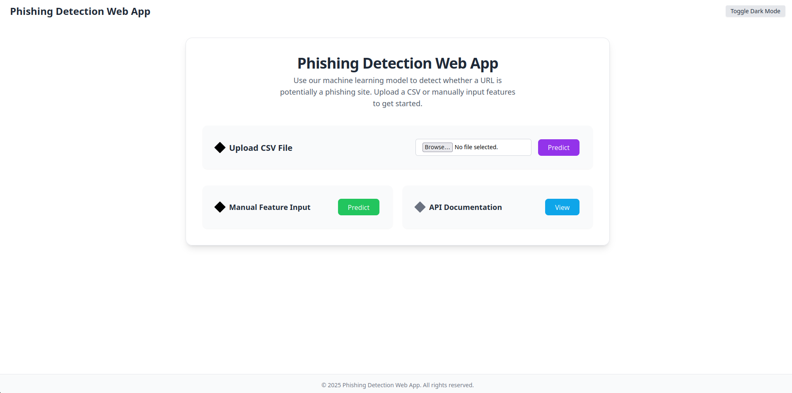
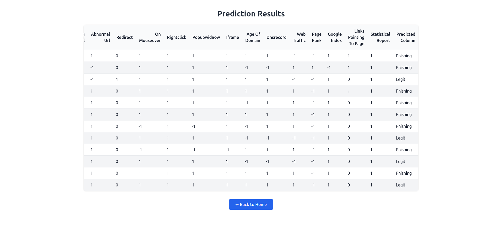
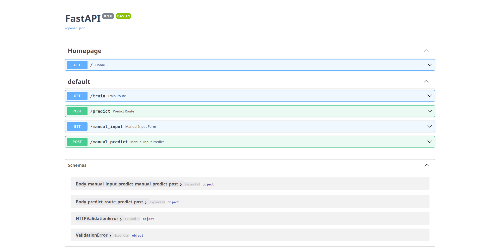

# Phishing Detection Web Application

A Flask-based web application designed to detect phishing websites using a trained machine learning model and a set of handcrafted URL-based features. The project is built with modularity, scalability, and usability in mind.

---

## Table of Contents

- [Overview](#overview)
- [Features](#features)
- [Project Structure](#project-structure)
- [Getting Started](#getting-started)
- [How to Use](#how-to-use)
- [API Documentation](#api-documentation)
- [Docker Support](#docker-support)
- [Technologies Used](#technologies-used)
- [Machine Learning Details](#machine-learning-details)
- [Deployment](#deployment)
- [Screenshots](#screenshots)
- [Future Improvements](#future-improvements)
- [License](#license)

---

## Overview

Phishing websites are deceptive platforms that trick users into revealing personal, financial, or security information by mimicking legitimate websites. With phishing attacks becoming more sophisticated and frequent, there is a growing need for automated tools that can detect these threats in real time.

This project aims to address that need by offering a web-based tool that predicts whether a given URL is legitimate or malicious. It combines handcrafted feature engineering and machine learning to provide reliable predictions via a user-friendly interface.

---

## Features

- Real-Time URL Prediction: Enter a URL to get immediate phishing detection results based on feature extraction.
- Batch Predictions: Upload a CSV file containing multiple URLs for bulk classification.
- Manual Feature Input: Input 30 handcrafted features manually for granular control and custom analysis.
- Prediction Results Display: View prediction labels and associated confidence scores.
- Interactive API Documentation: Swagger/OpenAPI support for developers to integrate the detection model.
- Dark/Light Mode Support: User interface supports theme switching.
- Responsive UI Components: Enhanced custom UI for uploading files and inputting data.
- Modular Backend Architecture: Designed for ease of expansion and maintenance.

---

## Project Structure

```bash
├── app.py                   # Main Flask app
├── main.py                  # Entry point script
├── network/                 # Core ML modules and pipeline
│   ├── components/
│   ├── constants/
│   ├── entity/
│   ├── exception/
│   ├── logging/
│   ├── pipeline/
│   └── utils/
├── final_model/             # Trained model and related artifacts
├── prediction_output/       # Output CSVs for batch predictions
├── notebook/                # Jupyter notebooks for model training and exploration
├── static/                  # Custom static files like CSS
│   └── style.css
├── templates/               # HTML templates
│   ├── index.html
│   ├── manual_form.html
│   ├── results.html
│   └── table.html
├── requirements.txt         # Dependency list
├── dockerfile               # Docker configuration
└── README.md                # Project documentation
```

---

## Getting Started

### Step 1: Clone the Repository

```bash
git clone https://github.com/alanjos3/network_security.git
cd network_security
```

### Step 2: Set Up Virtual Environment

```bash
python -m venv venv
source venv/bin/activate  # For Windows: venv\Scripts\activate
```

### Step 3: Install Dependencies

```bash
pip install -r requirements.txt
```

### Step 4: Run the Application

```bash
python app.py
```

Visit `http://127.0.0.1:5000/` in your browser.

---

## How to Use

### CSV Upload

1. Navigate to the home page.
2. Upload a `.csv` file containing URLs or corresponding features.
3. Click on **Predict** to view the results.

### Manual Feature Input

1. Go to the **Manual Input** section.
2. Fill in values for 30 handcrafted features (e.g., IP address usage, URL length, special symbols).
3. Submit the form to receive a prediction and a confidence score.

---

## API Documentation

For interactive API documentation, visit the following endpoint once the app is running:

```
http://127.0.0.1:5000/docs
```

This provides a Swagger UI interface for testing and integration.

---

## Docker Support

Build and run the application using Docker:

```bash
docker build -t phishing-detector .
docker run -p 5000:5000 phishing-detector
```

---

## Technologies Used

- Python
- FastAPI
- Scikit-learn / RandomForest
- HTML/CSS
- Docker

---

## Machine Learning Details

This project utilizes a trained machine learning model that evaluates a range of handcrafted URL-based features, including:

- Presence of IP address in the URL
- Length of the URL
- Use of shortening services
- Suspicious characters or patterns (e.g., `@`, `//`, `-`)
- ...

The model training code is located in the `network/pipeline/` directory.

---

## Deployment

This application is deployed on an Amazon EC2 instance using GitHub Actions and AWS ECR for container orchestration. The automated deployment pipeline includes:

 - Running unit tests on new commits to the main branch

   -Building a Docker image and pushing it to AWS Elastic Container Registry (ECR)

  - Connecting to the EC2 instance 

- Pulling the latest Docker image


---

## Screenshots





---

## Future Improvements

- Display confidence scores in prediction cards
- Enable real-time monitoring of new URLs
- Integrate SHAP or LIME for feature-level explanation

---

## License

This project is licensed under the MIT License.  